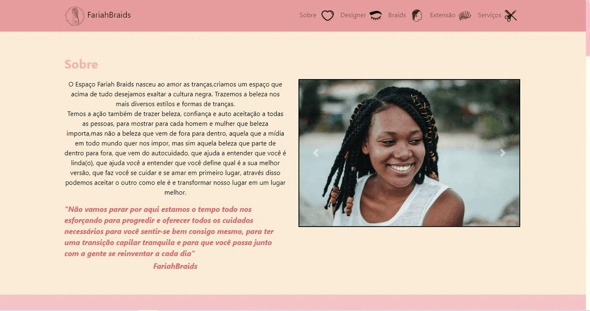

## Braids/FariahBraids  📜 

*"Não vamos parar por aqui estamos o tempo todo nos esforçando para progredir e oferecer todos os cuidados necessários para você sentir-se bem consigo mesmo, para ter uma transição capilar tranquila e para que você possa junto com a gente se reinventar a cada dia"*

<h4 align="center">
 FariahBraids
</h4>

## Sobre 📖

Projeto chamado Bradis, ele foi desenvolvio para um cliente.
O projeto tem como objetivo motivar as pessoas a conhecerem o espaço FariahBraids e experimentar um pouco do trabalho maravilhoso que ela faz com os cabelos e com as sombrancelhas .

## 🎨 Layout

## Site 💻

Conheça o site clicando em <a href="https://wandersondefariasprogramador.github.io/PROJETO-ENTREVISTA/">

<table>
  <tr>
     <td align="center">
      <a href="#">
         
        
          <b>wanderson de farias</b>
        
        
      </a>
    </td>
    <a 
